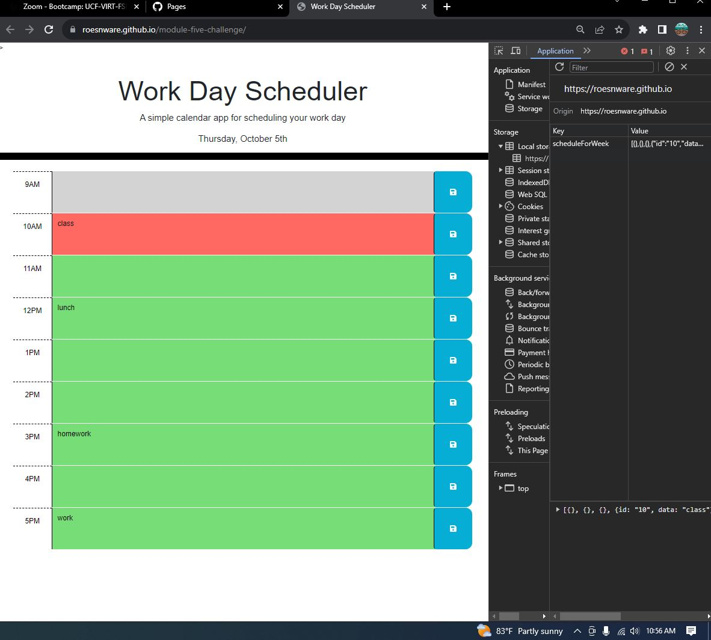

# Module 5 challenge 

## Description

My motivation whilst creating this repository was to make an application that allows me to manage my time better. I accomplished this by utilizing jquery and dayjs to help track the flow of my app and the apis to get data dynamically this is useful because it shows the current day and whether or not my schedule is on pace or not by styling the background accordingly using the current time as well as local storage to save the data locally so it is there even on a new web session.

## Table of Contents 

N/A

## Installation

N/A

## Usage

This application can now be utilized by anyone who would like to store a busy schedule.

## Credits

N/A

## License

Please refer to the LICENSE in the repo.

## Screenshot

## Deployment link

https://roesnware.github.io/module-five-challenge/
